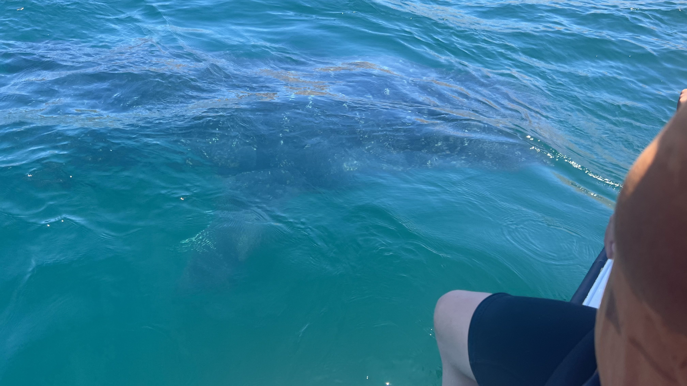
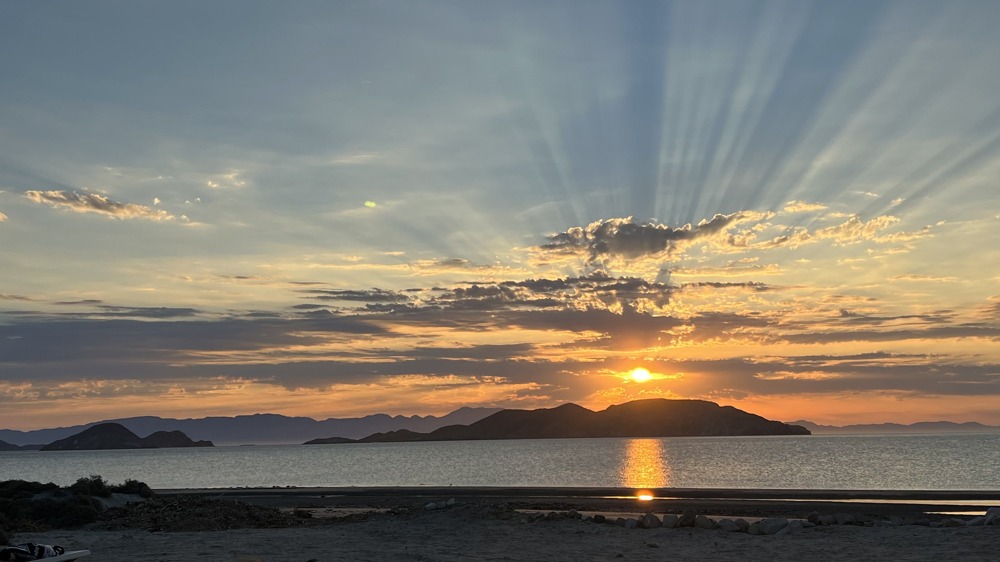
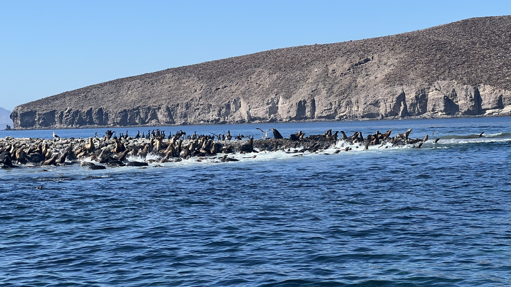

## My Journey to Environmental Studies

{fig-align="right" width="35%"}

As I entered my first year of college as a Biology major, I had plans to become a Veterinarian. I faced many hardships in that first year, and felt as though I did not enjoy what I was studying. Thus, over the course of that year, I changed my major multiple times trying to find something new that I loved. However, after a field studies program in Baja California for Marine Biology, I fell back in love with the subject, and applied to UCSB as an Environmental Studies major.

{fig-align="left" width="35%"}

## Education

As a third year student at UCSB, I have taken quite a few upper division Environmental Studies classes that have better prepared me for work in the field, including:

- ENVS 171 – Ecosystem Processes
- ENVS 127A – Foundations of Environmental Education
- ENVS 127B – Advanced Environmental Education and Practicum
- ENVS 193DS – Statistics for Environmental Science

Before transferring to UCSB, I attended Glendale Community College, from where I earned an A.A. in Liberal Arts: Science and Mathematics Emphasis.

{fig-align="center" width="50%"}