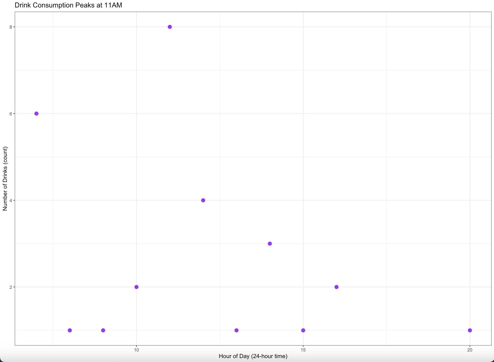

For my personal data project, I asked the question of "Does time of day influence my caffeine consumption?" Thus, I tracked the date and time of each caffeinated drink consumed between Weks 4-9 of the Spring 2026 quarter. On the image below, I graphed the specific time of day vs the amount of drinks consumed, and found that most drinks are consumed around 11am.



Code Chunk for the above image

```{r}
#| label: caffeinated-drinks-points
#| eval: false
#mutating times on the data table
drink_data <- clean_caffeine |> 
  mutate(hour = as.numeric(format(
    as.POSIXct(drink_date_and_time, format = "%m/%d/%Y %I:%M %p"),
    "%H"
  )))

#creating drinks per hour count
hourly_counts <- drink_data |>
  count(hour, name = "num_drinks")

#base layer: ggplot
ggplot(hourly_counts, aes(x = hour, y = num_drinks)) +
    #second layer: points
  geom_point(color = "purple", size = 3) +
    #relabeling title and axes
  labs(title = "Drink Consumption Peaks at 11AM",
       x = "Hour of Day (24-hour time)",
       y = "Number of Drinks (count)") +
   #changing theme from base
  theme_bw()
```